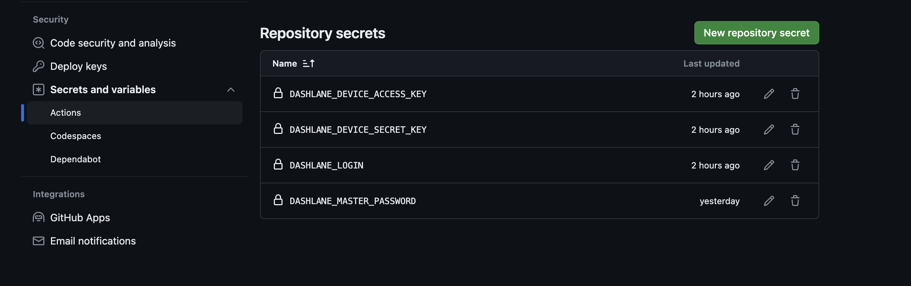

# Dashlane Load Secrets Action

## About

`load-secrets-action` is built using `Dashlane CLI` and `Github Actions`. It allows developers to inject their secrets vault from Dashlane to their github workfow.

## Requirements

-   `Dashlane CLI`for device registration
-   `Node.js` and `npm`to run the project locally

## How to run this project locally

1- install dependencies:

```sh
npm i
```

2- any change to the `index.js` requires a local build so that the the `dist` folder gets updated :

```sh
ncc build src/index.js
```

## How to use

1- Register your device locally

```sh
dcli devices register "server-name"
```

For more details refer to Dashlane CLI documentation https://dashlane.github.io/dashlane-cli

2- Set the environment variables prompted by the previous step in your GitHub repository’s secrets and variables



3- Set the same env variables in your pipeline as well as the ids of the secrets you want to read from Dashlane starting with `dl://`

```yml
steps:
    - uses: actions/checkout@v2
    - name: Load secrets
      id: load_secrets
      uses: ./ # Dashlane/github-action@<version>
      env:
          ACTION_SECRET_PASSWORD: dl://918E3113-CA48-4642-8FAF-CE832BDED6BE/password
          ACTION_SECRET_NOTE: dl://918E3113-CA48-4642-8FAF-CE832BDED6BE/note
          DASHLANE_DEVICE_ACCESS_KEY: ${{ secrets.DASHLANE_DEVICE_ACCESS_KEY }}
          DASHLANE_DEVICE_SECRET_KEY: ${{ secrets.DASHLANE_DEVICE_SECRET_KEY }}
          DASHLANE_LOGIN: ${{ secrets.DASHLANE_LOGIN }}
          DASHLANE_MASTER_PASSWORD: ${{ secrets.DASHLANE_MASTER_PASSWORD }}
```

4- Retrieve your secrets in any next step of your pipeline using `GITHUB_OUTPUT`

```yml
- name: test secret values
    env:
      ACTION_SECRET_PASSWORD: ${{ steps.load_secrets.outputs.ACTION_SECRET_PASSWORD }}
      ACTION_SECRET_NOTE: ${{ steps.load_secrets.outputs.ACTION_SECRET_NOTE }}
```
