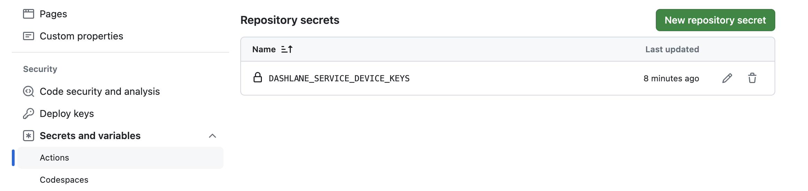

# Dashlane Load Secrets Action

`load-secrets-action` is built using `Dashlane CLI` and `Github Actions`. It allows developers to inject their secrets vault from Dashlane to their Github workflow.

## Usage

> [!IMPORTANT]  
> To setup this action you need a Dashlane account and the Dashlane CLI to be installed on your machine. You can download the Dashlane CLI [here](https://dashlane.github.io/dashlane-cli/install).

**1- Register your device locally**

```sh
dcli devices register "action-name"
```

For more details refer to Dashlane CLI documentation https://dashlane.github.io/dashlane-cli

**2- Set the environment variable prompted by the previous step in your GitHub repository’s secrets and variables**



**3- Set the same env variables in your pipeline as well as the ids of the secrets you want to read from Dashlane starting with `dl://`**

```yml
steps:
    - uses: actions/checkout@v2
    - name: Load secrets
      id: load_secrets
      uses: ./ # Dashlane/github-action@<version>
      env:
          ACTION_SECRET_PASSWORD: dl://918E3113-CA48-4642-8FAF-CE832BDED6BE/password
          ACTION_SECRET_NOTE: dl://918E3113-CA48-4642-8FAF-CE832BDED6BE/note
          DASHLANE_SERVICE_DEVICE_KEYS: ${{ secrets.DASHLANE_SERVICE_DEVICE_KEYS }}
```

**4- Retrieve your secrets in any next step of your pipeline using `GITHUB_OUTPUT`**

```yml
- name: test secret values
    env:
      ACTION_SECRET_PASSWORD: ${{ steps.load_secrets.outputs.ACTION_SECRET_PASSWORD }}
      ACTION_SECRET_NOTE: ${{ steps.load_secrets.outputs.ACTION_SECRET_NOTE }}
```

## Development

### Requirements

-   `Dashlane CLI`for device registration
-   `Node.js` and `npm`to run the project locally

### How to run this project locally

1- install dependencies:

```sh
npm i
```

2- any change to the `index.js` requires a local build so that the the `dist` folder gets updated :

```sh
ncc build src/index.js
```

## Contributing

Feel free to contribute to this project, fork and pull request your ideas. Don't include work that is not open source or not from you.
